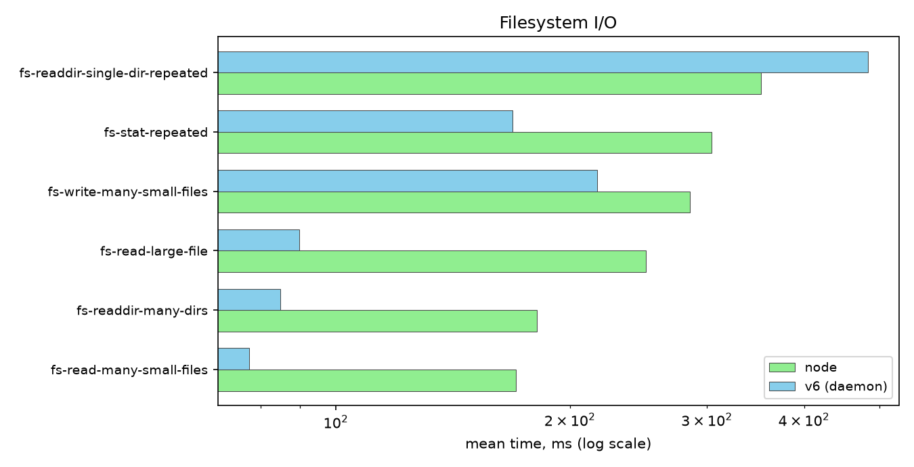
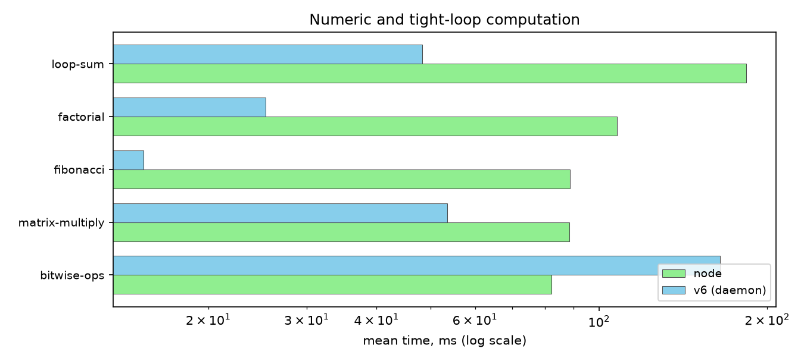
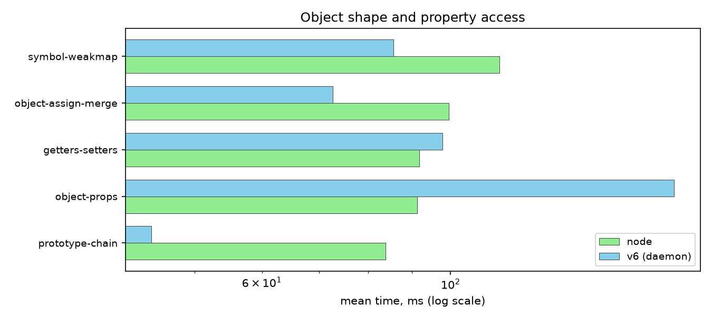
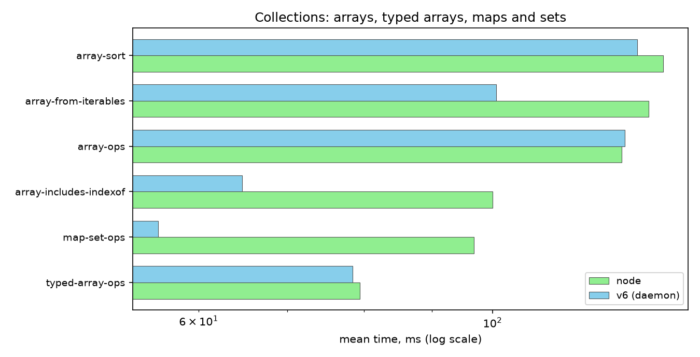
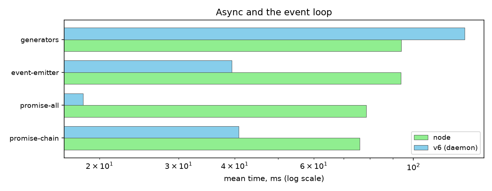
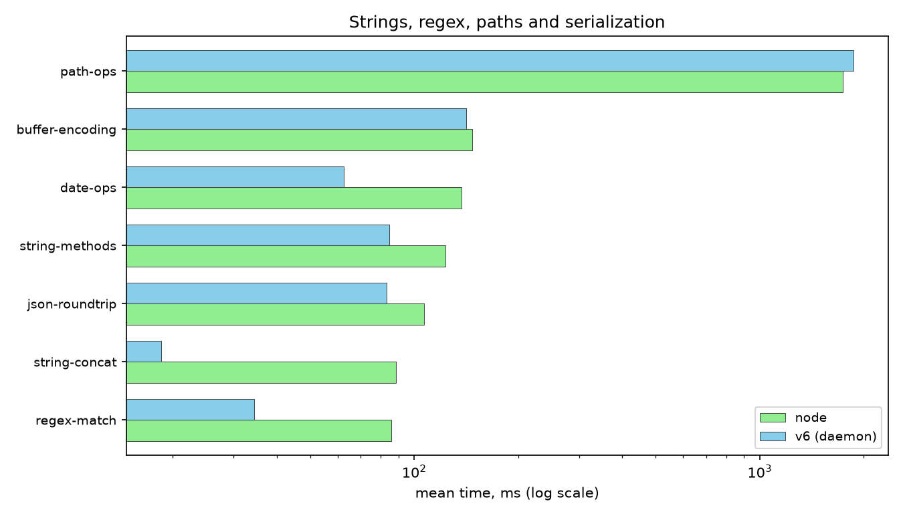
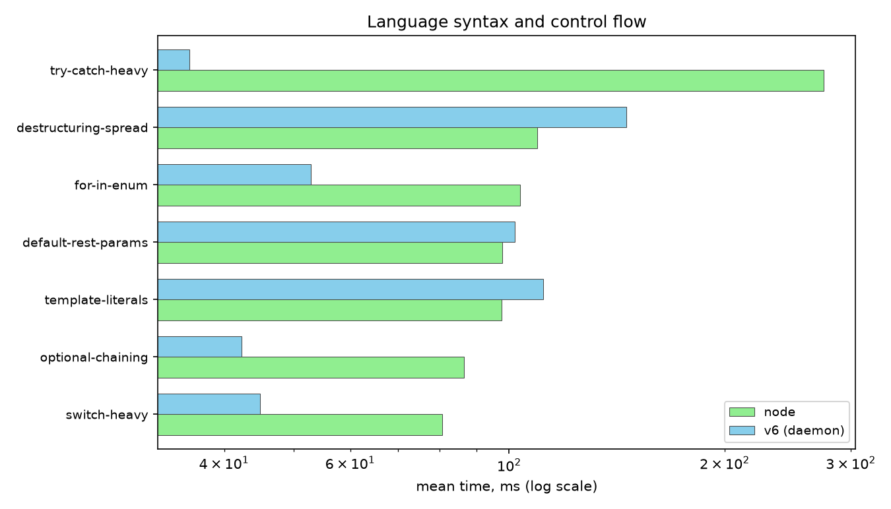

### Why compile JavaScript to JVM bytecode

Most JavaScript workloads that end up needing more than a script run inside one of two environments: a browser engine or Node. Both are C++ runtimes with their own garbage collector, their own thread model and their own process boundary.

That boundary is the part that matters here. The moment a team wants JavaScript logic to live inside a JVM process, whether that is a build tool, an application server, a batch job or a desktop app, they are choosing between shelling out to a separate Node process and paying serialization plus IPC cost on every call, or embedding a JS engine that was never designed to share a heap, a GC or a thread pool with the JVM.

[V6](https://github.com/v6js/v6) removes that boundary by targeting the JVM directly as a compilation target instead of treating it as a host to embed inside.

A `.js` file compiles to real `.class` files. A JavaScript function is a JVM method. A JavaScript value is a JVM object. Both share one process, one heap and one garbage collector.

The tradeoff is architectural, not cosmetic.

A runtime that compiles to native machine code through a mature JIT has decades of engineering behind escape analysis, inline caching and speculative optimization.

Compiling to JVM bytecode inherits the JVM's own JIT (HotSpot's C1/C2 tiers) for free once the bytecode is loaded, but the JVM's JIT was tuned for statically typed, class-shaped Java code, not for the dynamic property shapes and boxed numeric semantics JavaScript needs. V6's job is to emit bytecode that plays well with that JIT rather than fighting it, which is a different design problem than writing a JS engine from scratch.

### Single-pass compilation, no intermediate tree

V6's compiler has no AST.

Source text is lexed and parsed once, and bytecode is emitted directly during that single pass through a recursive-descent parser. Parsing and code generation are the same step, holding only the current parse state in memory rather than a tree for the whole file.

This has a real consequence: optimizations that require seeing the whole program before emitting code, such as whole-program dead code elimination or global constant folding across function boundaries, are not available to this architecture in the way they would be to a compiler with an IR.

What V6 gets in return is a compiler that is simple to reason about, fast to run and has no separate parse tree allocation overhead.

For a compiler whose main cost center is compile time itself rather than runtime code quality, since the JVM's own JIT recompiles hot methods after the fact anyway, this tradeoff favors compile speed.

### How a program becomes bytecode

Every module, whether it is the entry script or a file pulled in through `require` or `import`, compiles to its own JVM class.

The entry script compiles to a class named `Main` with a `public static void main(String[])` method. A CommonJS module required elsewhere in the program compiles to a class named `ModN`, where `N` is the order in which the module was first encountered, exposing a `moduleExports()` method that populates and caches the module's `module.exports` value on first call.

An ES module compiles the same way but exposes an `exports()` method returning the module's named export object, with export bindings resolved statically by scanning the module body for `export` syntax rather than trusting file extensions or a `package.json` field.

Every JavaScript value at runtime is a `V6Value`, an immutable Java record carrying a tag, a `double` and an `Object` reference.

The tag distinguishes number, boolean, null, undefined, object, string, function and bigint.

A number that fits in the small integer range from -1024 to 4096 is served from a preallocated cache array instead of allocating a new record, since integer literals and loop counters in typical JavaScript code fall in that range constantly.

Property access on plain objects goes through a shape system.

Each `V6Object` starts on a shared empty shape, and adding a property transitions it to a new shape that remembers the slot index for that key.

Objects that share the same sequence of added keys share the same shape and the same slot layout, which turns property reads into array indexing instead of a hash lookup for the first 24 properties added to an object. Past that fast-slot limit, the object falls back to a dictionary.

JVM bytecode itself imposes hard constraints that a compiler targeting it has to design around.

A method body is capped at 65535 bytes of bytecode, the constant pool is capped at 65535 entries and local variable slots are addressed with an unsigned 16-bit index.

Embedding a `.json` module as a compiled string constant, for example, has to chunk the file's contents into pieces no larger than 60000 bytes each and concatenate them at class-init time, because a single UTF-8 string constant that large risks tripping the constant pool's own encoding limits.

### Two ways to run a compiled program

Running `v6 app.js` compiles the script and its dependency graph, then hands the resulting bytecode to a persistent background process instead of booting a fresh JVM.

The first invocation starts that background process, and every subsequent invocation from the same machine reuses it, paying no JVM startup cost at all. This is the default and the fast path.

Passing `-o app.jar` skips the persistent process and instead packages the compiled classes, along with V6's own runtime classes, into a single runnable JAR.

That JAR runs with a plain `java -jar app.jar` and has no dependency on V6 being installed on the machine that runs it, at the cost of paying a full JVM boot on every single invocation.

This mode exists for the case where a standalone artifact matters more than repeated-invocation latency, such as shipping a CLI tool to a machine that only has a JDK on it.

### Compiling once, running many times

Compilation itself is not free, and for a multi-file program pulling in real dependencies, most of the wall-clock cost of a fresh invocation is spent recompiling files that have not changed since the last run.

V6 caches compiled output on disk, keyed by the entry script's absolute path together with the modification time and size of every file that was touched while compiling it, including every transitively required module.

On the next invocation, if the entry script and every one of those tracked files still match the recorded modification time and size, compilation is skipped entirely and the cached bytecode is used directly. Editing any one file in the dependency graph, even one several `require` calls deep, invalidates the cache for that entry point and forces a fresh compile.

This is the same trust model `make` and `ccache` use for deciding whether a build step needs to rerun, applied to a JavaScript compiler's own module graph instead of to object files.

### Java interop

Java code is reachable from JavaScript through a `java:` import scheme.

```js
import ArrayList from "java:java.util.ArrayList";

const list = new ArrayList();
list.add("hello");
console.log(list.get(0));
```

Resolving `java:java.util.ArrayList` calls `Class.forName` against that fully qualified name at runtime.

The resulting `V6JavaClassObject` wraps the `Class` object and exposes `new`, static methods and static fields as ordinary JavaScript operations.

Calling a Java method or constructor from JavaScript runs a scored overload resolution pass across every candidate method or constructor with that name, matching each JavaScript argument against each candidate's parameter types (including varargs expansion) and picking the lowest-scoring, meaning closest, match, the same problem Java's own compiler solves at compile time but resolved here at call time through reflection.

The direction that matters more for embedding JavaScript inside a Java application is the reverse one: implementing a Java interface from JavaScript.

Passing a plain JavaScript function or object anywhere a Java interface type is expected creates a `java.lang.reflect.Proxy` backed by a `V6JavaProxyHandler`. Invoking any method on that proxy from Java code calls back into the corresponding JavaScript function, marshalling arguments and the return value between `V6Value` and native Java types.

If that invocation happens off V6's own main thread, which is the normal case for GUI callbacks firing on a toolkit's event thread, the call is posted onto V6's event loop and the calling Java thread blocks on a `CountDownLatch` until the JavaScript callback finishes, unless the interface method returns `void`, in which case the callback runs asynchronously and the Java thread does not wait.

That mechanism is what makes something like this work, using nothing but the standard library that ships with a JDK.

```js
import { JFrame, JButton, JTextField } from "java:javax.swing";
import BorderLayout from "java:java.awt.BorderLayout";

const frame = new JFrame("v6 demo");
const input = new JTextField(20);
const button = new JButton("Add");

button.addActionListener((e) => {
  console.log("clicked with input:", input.getText());
});

frame.getContentPane().add(input, BorderLayout.CENTER);
frame.getContentPane().add(button, BorderLayout.SOUTH);
frame.setSize(300, 100);
frame.setVisible(true);
```

`addActionListener` expects a Java `ActionListener`. Passing an arrow function directly is enough.

This ran as written against the real Swing API, using only `Class.forName` and `java.lang.reflect.Proxy` from the JDK itself, which means it works against any Java library already on the classpath, not just ones V6 ships bindings for.

### What this means for Java developers

A JVM application that wants a scripting or extension layer today typically either ships a separate process and pays IPC cost for every call across that boundary, or embeds a JS engine that runs on its own heap with its own GC, meaning objects crossing between the host application and the scripted layer have to be copied or wrapped rather than referenced directly.

V6 compiles JavaScript into the same class loader, the same heap and the same GC as the surrounding Java application. A `V6Value` referencing a Java object holds a direct reference to that same object on that same heap.

Passing a Java object into JavaScript and having a JavaScript closure hold onto it works exactly like it would if both were written in Java, because at the bytecode level, they both are.

This turns JavaScript into a plausible embedded scripting layer for rules engines, plugin systems or configuration logic inside an existing Java codebase without introducing a second process, a second GC pause source or a serialization boundary to maintain.

### What this means for JavaScript developers

The `java:` import scheme is a doorway into the entire JDK class library and, by extension, every Java library already sitting on the classpath. Swing and AWT for desktop GUIs, JDBC drivers for essentially every relational database, mature build and packaging tooling, enterprise libraries with decades of production hardening behind them, all of it is reachable with a plain `import` statement, resolved through the same reflection machinery described above.

Anything expressible as a Java interface is implementable as a plain JavaScript function or object literal.

### Node.js module resolution and compatibility

Both `require` and `import` work, including within the same project, and `node_modules` resolution follows the same algorithm Node uses, walking up parent directories and reading a package's `package.json` `main` and `exports` fields.

Circular requires and circular imports both work.

Whether a given file is treated as CommonJS or an ES module is decided by scanning the file itself for `export` syntax rather than trusting a `.mjs` or `.cjs` extension or a `package.json` `type` field, since that scan is cheap and does not depend on a package's own metadata being correct.

V6 is tested against real npm packages, not synthetic fixtures, including `express`, `fast-glob`, `react` and `react-dom`, with output diffed against the same code running under Node.

### Benchmarks

The `bench/` suite in the V6 repository runs 40 fixtures, each covering a different language or standard library feature.

Every fixture runs under `node` and under `v6` in its default persistent-process mode, timed with a `hyperfine` benchmark using 6 warmup runs followed by a minimum of 5 timed runs per command, on an Intel Core i7-4800MQ (Haswell, 4 cores, 8 threads) with 8 GB of RAM, against `node v26.5.0` and `v6 v0.1.0`.

AOT mode is not part of these numbers. Its tradeoff, paying a full `java -jar` boot on every run in exchange for a standalone artifact, was already covered above, and mixing it into a same-scale comparison against two already-warm processes would misrepresent what it is for.

`v6`'s persistent process is faster than `node` on 30 of these 40 fixtures.

The 40 fixtures are grouped below by which part of the runtime each one exercises, since averaging unrelated workloads into one number hides where the wins and the losses come from.

#### Filesystem I/O



`v6`'s `fs` module maps `readdirSync`, `statSync`, `readFileSync` and `writeFileSync` directly onto blocking `java.nio.file.Files` calls, the same synchronous file APIs a plain Java program would use. That gives `v6` a direct win on 5 of these 6 fixtures.

The exception is `fs-readdir-single-dir-repeated`, which lists a single 2000-file directory 200 times in a row. Building a JavaScript-visible array of 2000 filenames from a Java directory stream on every one of those 200 calls is the one filesystem pattern in this suite where `node` comes out ahead.

#### Numeric and tight-loop computation



`factorial`, `fibonacci`, `loop-sum` and `matrix-multiply` are pure floating-point addition and multiplication loops. Since a `V6Value` number already carries its payload as a `double`, these loops need no conversion between the value's internal representation and the arithmetic being done on it, and `v6` wins all four decisively.

`bitwise-ops` is the opposite case: it does `<<`, `>>>`, `^`, `&` and `|` against a running accumulator half a million times.

Every one of those operations requires converting the `double` payload to a 32-bit integer, doing the bitwise operation and converting the result back to a `double` to store in a new `V6Value`, and that conversion cost on every single operation is why this is the one fixture in the group `node` wins.

#### Object shape and property access



`prototype-chain`, `object-assign-merge` and `symbol-weakmap` win for `v6`. `getters-setters` and `object-props` do not.

`object-props` specifically constructs 300000 instances of a two-field class and calls an instance method on each one, which stresses object construction and method dispatch throughput rather than the shape system's property lookup path described earlier, since two fields never come close to the 24-slot fast path limit.

This group is the clearest case in the whole suite where the loss is about allocation and dispatch cost, not about property access itself.

#### Collections: arrays, typed arrays, maps and sets



`v6` wins 5 of these 6 fixtures, most clearly on `map-set-ops`.

`array-ops` is close to a tie and lands on `node`'s side by a small margin.

#### Async and the event loop



`promise-all`, `promise-chain` and `event-emitter` all win for `v6`, backed by a microtask queue that is a plain in-process `ArrayDeque` rather than anything crossing a thread or a process boundary.

`generators` is the exception. Each JavaScript generator in `v6` runs on its own Java virtual thread so that `yield` can suspend and resume the generator's own call stack, and creating and parking a virtual thread per generator costs more than the callback-queue path the other three fixtures in this group take.

#### Strings, regex, paths and serialization



Six of these seven fixtures win for `v6`, including `string-concat` by a wide margin, backed by the rope-based string representation described earlier avoiding the repeated copying a chain of `+=` would otherwise cost.

`path-ops` is the one exception, essentially tied with a small edge to `node`, running 500000 iterations of `path.join`, `path.resolve` and `path.parse` against synthetic paths.

#### Language syntax and control flow



This is the most evenly split group, 4 wins for `v6` against 3 for `node`.

`try-catch-heavy` is the largest margin in either direction in this group. It throws a real `Error` on roughly one in seven of 100000 iterations, and since the fixture never sets `Error.prepareStackTrace`, every one of those throws takes the cheap path described earlier: formatting a `name: message` string rather than walking the call stack.

`destructuring-spread`, `default-rest-params` and `template-literals` go the other way, each one dominated by per-token parser and codegen cost for the specific syntax under test rather than by anything the runtime does once the bytecode is already running.

### Current limitations

V6 is experimental. Test262 conformance testing is not yet part of the release process, so spec conformance beyond what the fixture and compatibility test suites happen to exercise is not independently verified yet.

`WebAssembly`, `Proxy`, `Reflect`, `eval` and the `vm` module are not implemented.

A method compiled from a single JavaScript function is still bound by the JVM's 65535-byte method size limit, which means a single function with an extraordinarily large body, generated code being the realistic case rather than hand-written code, can fail to compile.
